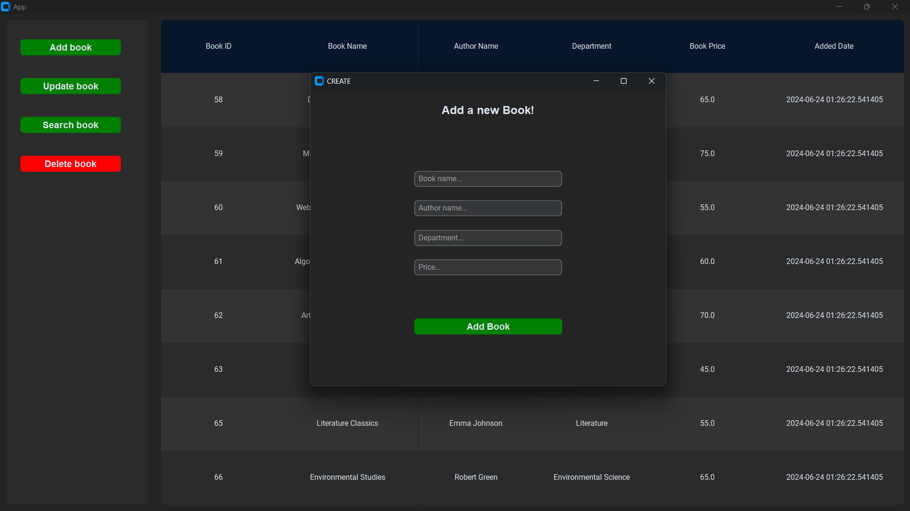
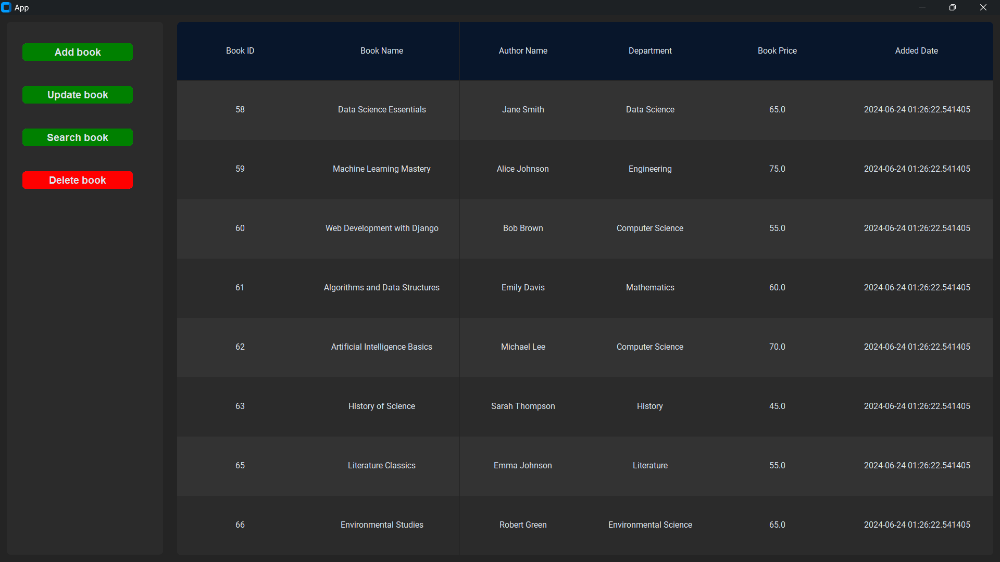
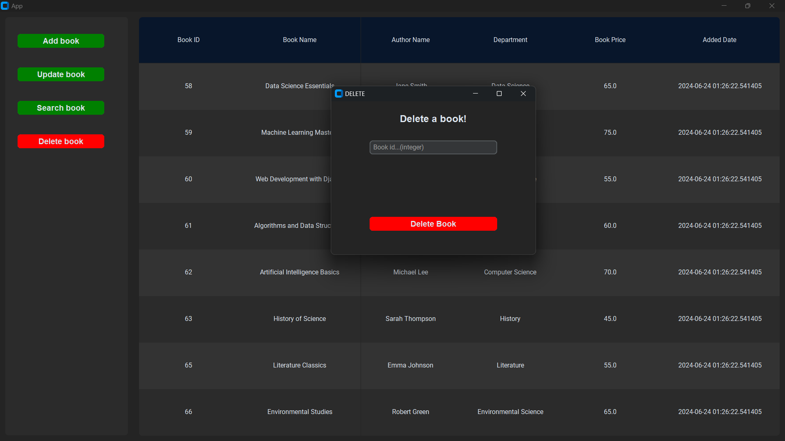
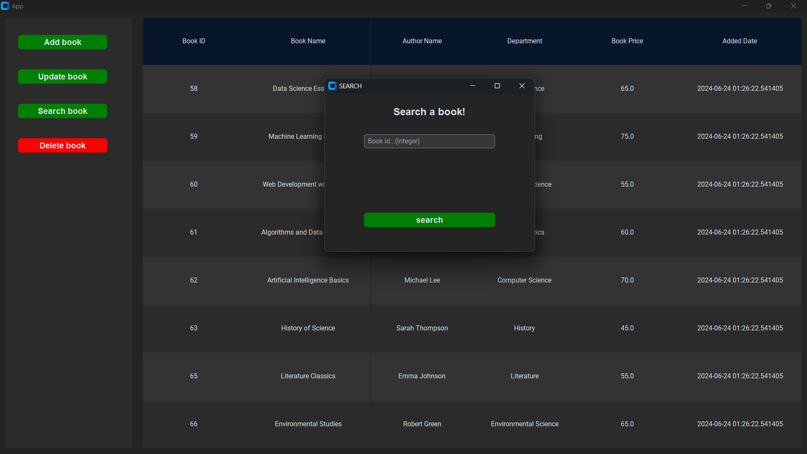
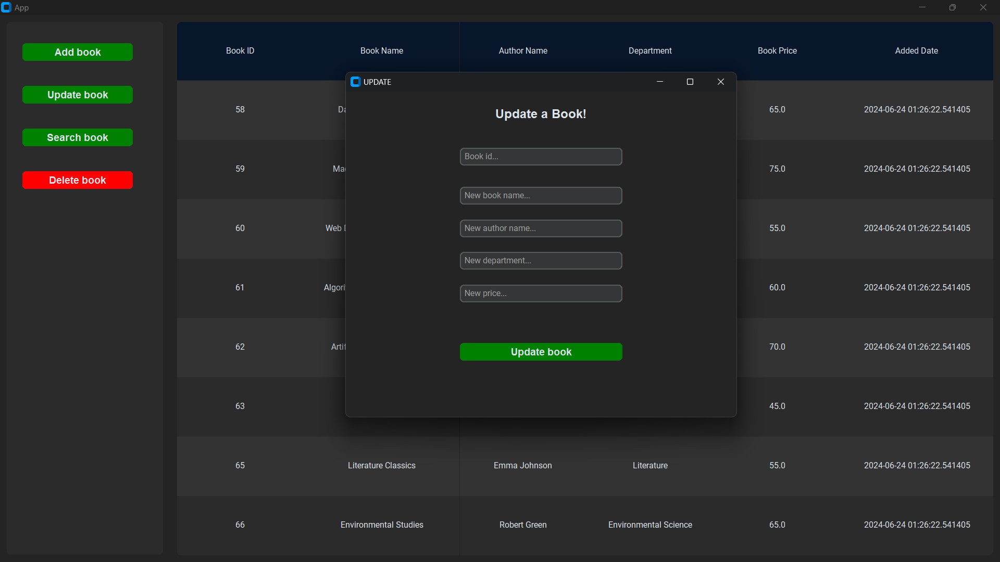

<div align="center">
  
# CustomeTkinter Book Management App


</div>

## Screenshots

<div align="center">
  
    
    
    
    
    

</div>

## Installation

```bash
  git clone https://github.com/adnaaaen/tkinter-Book-service.git
  cd tkinter-Book-service
```

```bash
  pip install -r requirements.txt
```

```bash
  python app/main.py
```

## Environment Variables

- `DATABASE_URL`

create a `.env` file at the root of the `app` folder and add the following:

Below are examples of how to set up the `DATABASE_URL` for different types of local databases:

- For `PostgreSQL`
  `DATABASE_URL=postgresql://your_username@localhost:5432/your_database_name`

- For `MySQL`
  `DATABASE_URL=mysql://your_username@localhost:3306/your_database_name`
